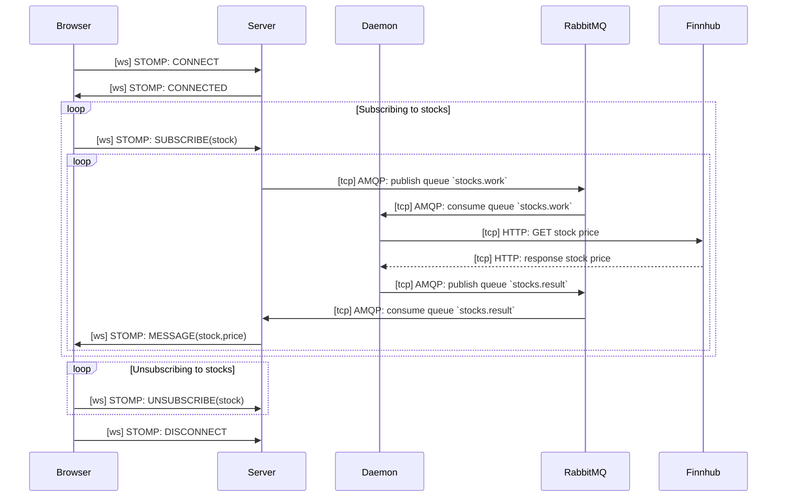

# Stocks Client

Inspired by client code of O'Reilly's book Websocket, chatper 4, and using React.

To run,

```bash
yarn

# start RabbitMQ
docker run -it --rm --name rabbitmq -p 5672:5672 -p 15672:15672 rabbitmq:3-management

# in another terminal, start the server
yarn ts-node src/ch04/server/server.ts

# in another terminal, start the deamon
yarn ts-node src/ch04/server/deamon.ts

# in another terminal
yarn rollup -c src/ch04/client/rollup.config.js -w

# in another terminal
yarn serve src/ch04/client
```

You can now open the browser at the URL provided by the `serve` command to view realtime stock data. The stock data is provided by [Finnhub][1].

The above processes are connected as follows



[1]: https://finnhub.io/docs/api